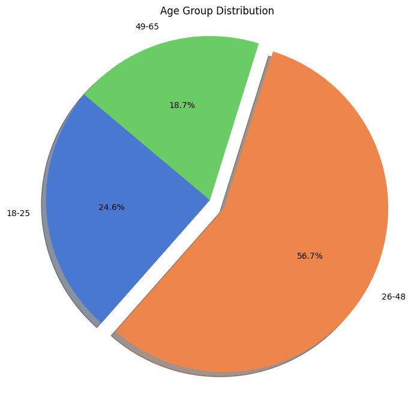
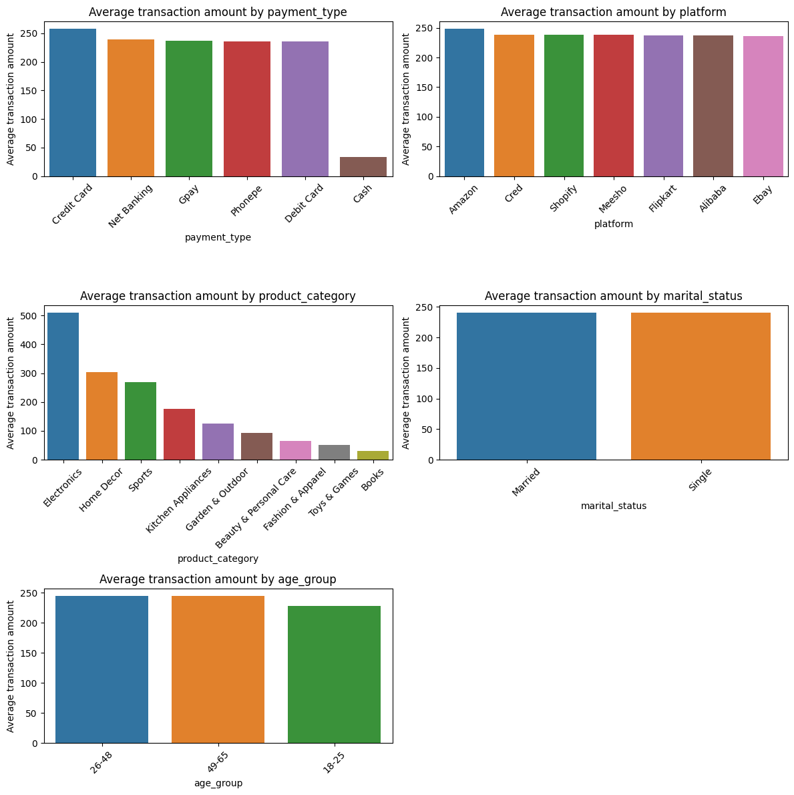
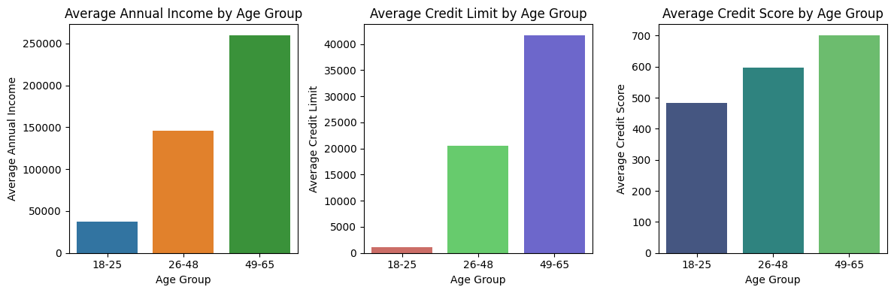
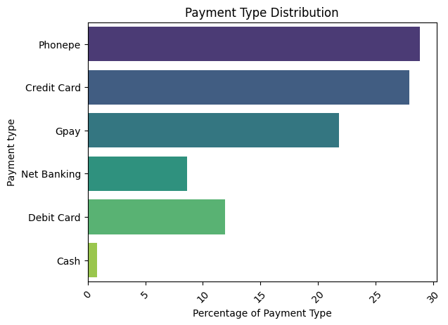
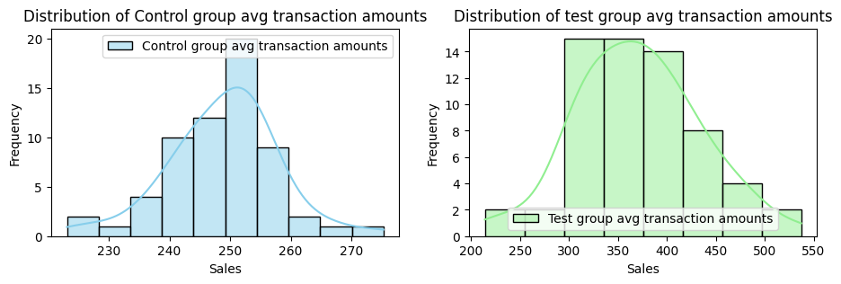

# Credit Card Data Analysis - Market Research and A/B Testing 

## 📊 Project Overview

This project analyzes customer data, credit profiles, and transaction patterns to identify the optimal target market for launching a new credit card product. The analysis is conducted in two phases:

**Phase 1**: Comprehensive Data Analysis and Visualization (Current Phase)
- Data loading from multiple sources (CSV and MySQL database)
- Data cleaning and preprocessing
- Exploratory data analysis (EDA)
- Customer segmentation and profiling
- Transaction pattern analysis

**Phase 2**: Predictive Modeling and Evaluation (Future Development)
- Machine learning model development
- Customer behavior prediction
- Risk assessment modeling

### 🎯 Key Business Objectives
- Identify the most promising customer segments for credit card adoption
- Analyze spending patterns across different demographics
- Understand payment preferences and platform usage
- Determine optimal credit limits and risk factors
- Provide data-driven recommendations for market entry strategy

## 🛠️ Technologies Used

### Core Technologies
- **Python 3.x** - Primary programming language
- **Jupyter Notebook** - Interactive development environment
- **MySQL** - Database management system

### Data Analysis & Visualization Libraries
- **pandas** - Data manipulation and analysis
- **NumPy** - Numerical computing
- **matplotlib** - Basic plotting and visualization
- **seaborn** - Statistical data visualization
- **mysql-connector-python** - MySQL database connectivity

### Statistical Analysis
- **scipy** - Scientific computing (implied usage)
- **sklearn** - Machine learning preparation (Phase 2)

## ✨ Key Features

### 📈 Data Processing & Quality Assurance
- **Multi-source Data Integration**: Seamless loading from both CSV files and MySQL database
- **Comprehensive Data Cleaning**: Handles missing values, outliers, and data inconsistencies
- **Data Validation**: Cross-verification between customer, credit profile, and transaction data
- **Outlier Detection**: Statistical methods (IQR, Z-score) for identifying and handling anomalies

### 👥 Customer Analytics
- **Demographic Segmentation**: Age groups (18-25, 26-48, 49-65), gender, location analysis
- **Income Analysis**: Occupation-wise income distribution and patterns
- **Credit Profiling**: Credit score, credit limit, and creditworthiness assessment
- **Behavioral Insights**: Payment preferences and platform usage patterns

### 💳 Transaction Intelligence
- **Spending Pattern Analysis**: Category-wise transaction analysis
- **Platform Performance**: E-commerce platform comparison (Amazon, Flipkart, Alibaba)
- **Payment Method Preferences**: Credit card vs. other payment types
- **Product Category Insights**: Electronics, Fashion, Beauty & Personal Care trends

### 📊 Advanced Visualizations
- **Interactive Charts**: Bar plots, histograms, pie charts for comprehensive data representation
- **Multi-dimensional Analysis**: Subplot arrangements for comparative insights
- **Statistical Distributions**: Age, income, and credit score distributions
- **Correlation Analysis**: Relationship mapping between key variables

## 📁 Project Structure

```
credit-card-eda/
├── phase1_creadit_card.ipynb    # Main analysis notebook
├── data/                        # Data directory
│   ├── customers.csv           # Customer demographic data
│   ├── credit_profiles.csv     # Credit scores and limits
│   ├── transactions.csv        # Transaction history
│   ├── avg_transactions_after_campaign.csv  # Campaign performance data
│   └── E_MasterCardDump.sql    # Database schema and sample data
├── Plots/                       # Generated visualization outputs
│   ├── Phase01.png             # Phase 1 analysis plots
│   ├── Phase02.png             # Customer demographics visualizations
│   ├── Phase03.png             # Transaction pattern analysis
│   └── Phase04.png             # Credit profile insights
├── README.md                   # Project documentation
└── requirements.txt            # Python dependencies
```

### Data Schema Overview
- **customers.csv**: Customer demographics (age, gender, location, occupation, marital status, annual income)
- **credit_profiles.csv**: Credit information (customer ID, credit score, credit limit)
- **transactions.csv**: Transaction details (amount, platform, product category, payment type)
- **avg_transactions_after_campaign.csv**: Post-campaign performance metrics

## 🖼️ Sample Visualizations - Phase 1 Analysis

Our analysis generates comprehensive visualizations to support data-driven decision making. Below are sample plots from the Phase 1 analysis:

### Phase 1: Data Overview & Customer Demographics



*Overview of customer data distribution and initial insights*


*Overview of customer data distribution and initial insights*

### Customer Segmentation & Demographics

*Age group distribution, gender analysis, and location-based segmentation*

### Transaction Pattern Analysis

*Platform performance, payment methods, and spending category analysis*

### Credit Profile Insights

*Credit score distribution, income analysis, and risk assessment visualizations*

These visualizations help identify key patterns in customer behavior, spending habits, and demographic trends that inform our target market recommendations.

### Phase 2: Hypothetical Z-Test Example
In Phase 2, we will implement statistical tests to validate our findings. For example, a hypothetical Z-test to compare average transaction amounts before and after a marketing campaign:

### Distribution of Average Transaction Amounts

*Credit score distribution, income analysis, and risk assessment visualizations*


## 🚀 Setup Instructions

### Prerequisites
- Python 3.7 or higher
- MySQL Server (if using database functionality)
- Jupyter Notebook or Jupyter Lab

### Installation Steps

1. **Clone the Repository**
   ```bash
   git clone <repository-url>
   cd credit-card-eda
   ```

2. **Create Virtual Environment** (Recommended)
   ```bash
   python -m venv credit_card_env
   
   # Windows
   credit_card_env\Scripts\activate
   
   # macOS/Linux
   source credit_card_env/bin/activate
   ```

3. **Install Dependencies**
   ```bash
   pip install pandas numpy matplotlib seaborn mysql-connector-python jupyter
   ```

4. **Database Setup** (Optional - for MySQL functionality)
   ```sql
   -- Create database
   CREATE DATABASE e_master_card;
   
   -- Import the provided SQL dump
   mysql -u root -p e_master_card < data/E_MasterCardDump.sql
   ```

5. **Launch Jupyter Notebook**
   ```bash
   jupyter notebook phase1_creadit_card.ipynb
   ```

### Configuration
- Update MySQL connection parameters in the notebook:
  ```python
  conn = mysql.connector.connect(
      host='localhost',
      user='your_username',
      password='your_password',
      database='e_master_card'
  )
  ```

## 📋 Usage Instructions

1. **Data Loading**: The notebook supports both CSV and MySQL data sources
2. **Sequential Execution**: Run cells in order for proper data flow
3. **Interactive Analysis**: Modify parameters to explore different aspects of the data
4. **Visualization**: All charts are automatically generated and can be customized

## 🎯 Key Insights & Recommendations

### Target Market Identification
Based on our comprehensive analysis, we recommend targeting the **18-25 age group** for the initial credit card launch:

#### Market Characteristics:
- **Market Size**: 26% of the customer base
- **Average Income**: Under $50,000 annually
- **Credit Profile**: Limited credit history, providing growth opportunity
- **Payment Behavior**: Lower current credit card usage (expansion potential)

#### Strategic Advantages:
1. **Growth Potential**: Young professionals entering peak earning years
2. **Digital Natives**: High engagement with e-commerce platforms
3. **Category Preferences**: Strong spending in Electronics, Fashion & Apparel, Beauty & Personal Care
4. **Market Gap**: Underserved by traditional credit products

### Implementation Strategy:
- **Conservative Credit Limits**: Start with lower limits matching income levels
- **Digital-First Approach**: Mobile-optimized application and management
- **Category Rewards**: Focus on popular spending categories
- **Financial Education**: Build credit literacy alongside product adoption

## 🔮 Future Enhancements

### Phase 2 Development Roadmap:
1. **Predictive Modeling**
   - Customer lifetime value prediction
   - Default risk assessment models
   - Spending behavior forecasting

2. **Advanced Analytics**
   - Machine learning-based segmentation
   - Real-time fraud detection
   - Personalized credit limit optimization

3. **Business Intelligence**
   - Interactive dashboards
   - Automated reporting systems
   - A/B testing framework for marketing campaigns

### Technical Improvements:
- **Data Pipeline Automation**: ETL processes for real-time data updates
- **Cloud Integration**: AWS/Azure deployment for scalability
- **API Development**: RESTful APIs for model serving
- **Performance Optimization**: Big data processing capabilities

## 🤝 Contributing

We welcome contributions to improve this analysis! Please consider:

1. **Data Quality**: Additional data sources or validation methods
2. **Visualization**: New chart types or interactive visualizations
3. **Statistical Methods**: Advanced analytical techniques
4. **Documentation**: Code comments and methodology explanations

### Contribution Guidelines:
- Fork the repository
- Create a feature branch
- Add comprehensive documentation
- Submit pull request with detailed description

## 📞 Support & Contact

For questions, suggestions, or collaboration opportunities:
- **Issues**: Use GitHub Issues for bug reports and feature requests
- **Discussions**: GitHub Discussions for general questions
- **Documentation**: Refer to inline notebook documentation

## 📄 License

This project is intended for educational and research purposes. Please ensure compliance with data privacy regulations when using real customer data.

---

**Note**: This analysis provides insights based on historical data patterns. Business decisions should incorporate additional market research, regulatory requirements, and risk assessment factors.
